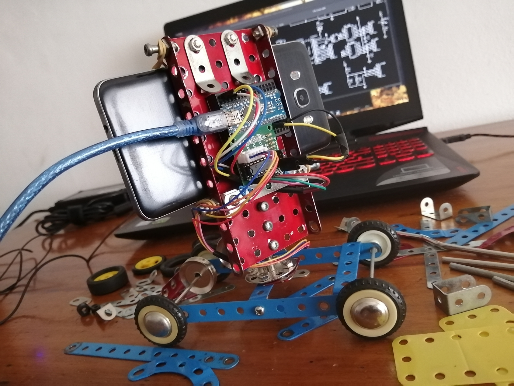
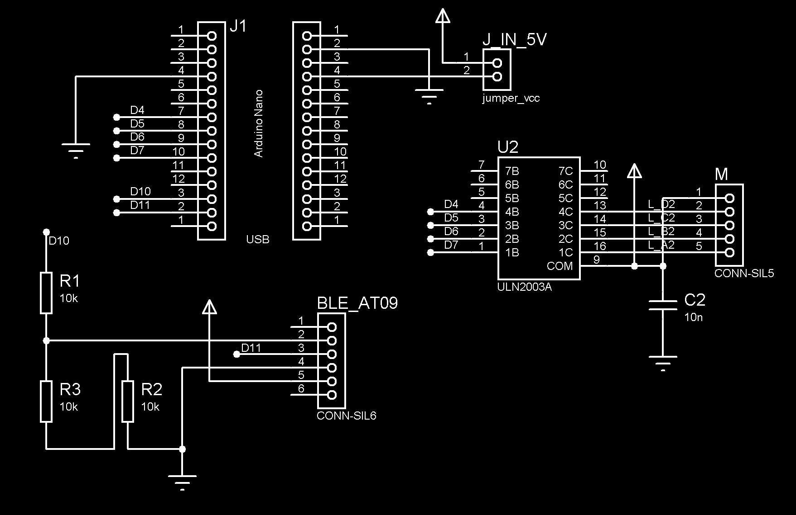

# MTR - Motion Timelapse Robot

Deslizador para cámara de bajo presupuesto - Low Cost Camera Slider

  

## Etapas
  
 [x] Fase 1: Avance a velocidad constante indefinidamente.  
 [x] Fase 2: Avance a velocidad constante la distancia indicada.  
 [ ] Fase 3: Avance con velocidad variable según función de aceleración (cero, constante, triangular).  
 [ ] Fase 4: Segundo motor para controlar ángulo.  
 [ ] Fase 5: Seguimiento de objetivos estáticos.  
 [ ] Fase 6: Control por bluetooth.  

## Fase 2

#### Parámetros constantes  
  - Pasos por vuelta del eje.  
  - Distancia de avance por revolución del eje.  

#### Inputs:  
  - Distancia a recorrer en cm.  
  - Duración de la grabación en segundos.  

#### Output:  
  - Frecuencia o periodo de stepping.  
  - Cantidad máxima de steps.  

## Esquemáticos

  
